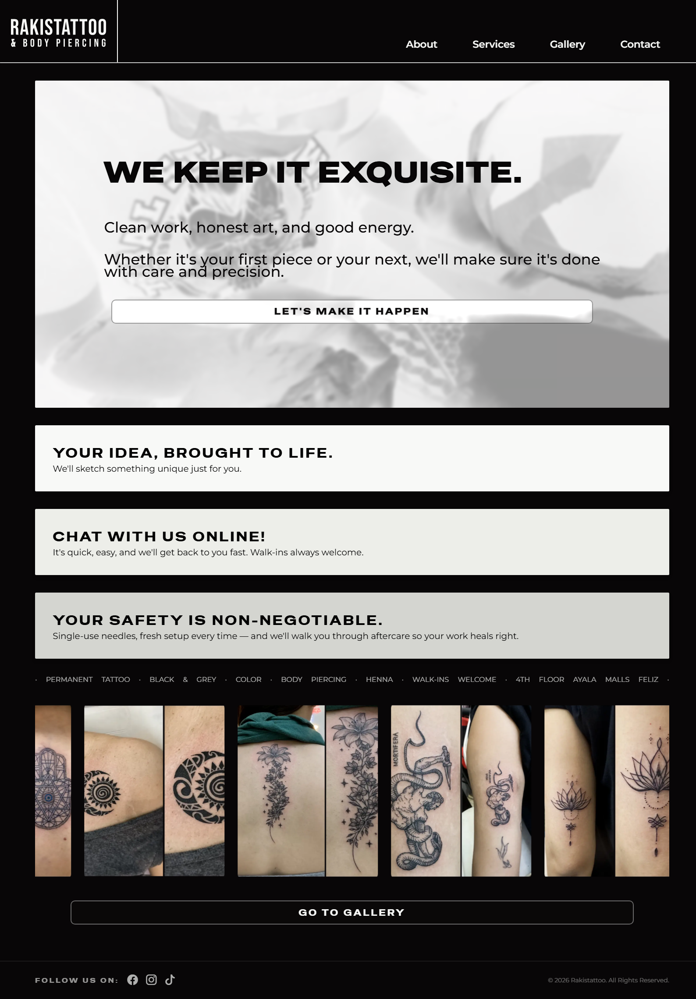
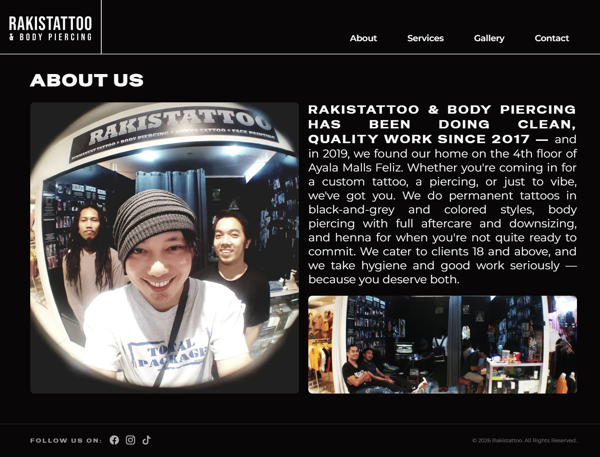
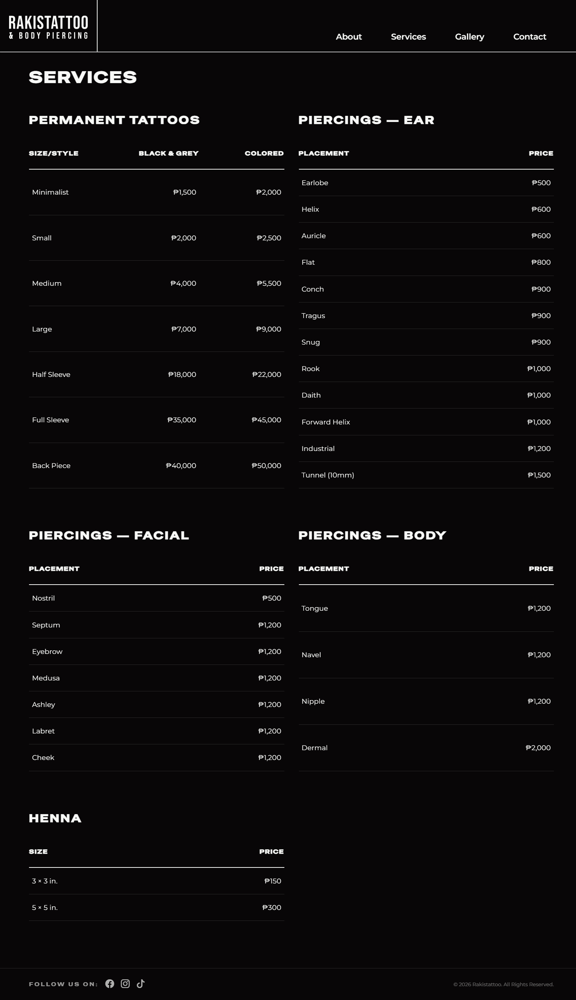
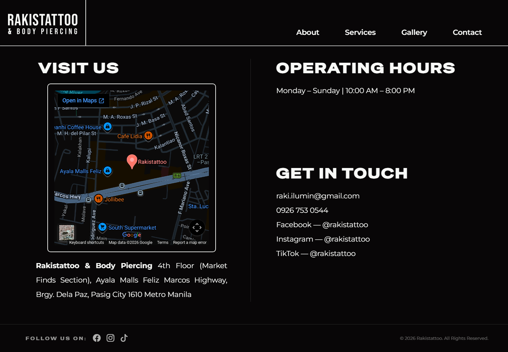

# Rakistattoo & Body Piercing

Web Development 111 Project - Static Website

 BSIT 1-Y2-4

- CHIEFE, John Willy

- DE JUAN, Jamie Eliz

- GUEVARRA, Thea

- MURRILLO, Kristine Mae

## Project Description
A static website for Rakistattoo & Body Piercing, a tattoo and piercing shop located at Ayala Malls Feliz, Pasig City.

## Features Implemented
- Responsive multi-page layout (Home, About, Services, Gallery, Contact)
- Hero section with animated font cycling effect
- Infinite marquee gallery preview
- Lightbox gallery with full-resolution image viewing
- Embedded Google Maps
- Mobile-responsive sidebar navigation
- Price tables for tattoo, piercing, and henna services

## Pages
- `index.html` — Homepage
- `about.html` — About the shop
- `services.html` — Price guide
- `gallery.html` — Photo gallery
- `contact.html` — Contact and location.

## Live Site Link

https://theaguevarra.github.io/WBDV111_MidtermLabExam-RAKISTATTOO/

## Site Screenshots

